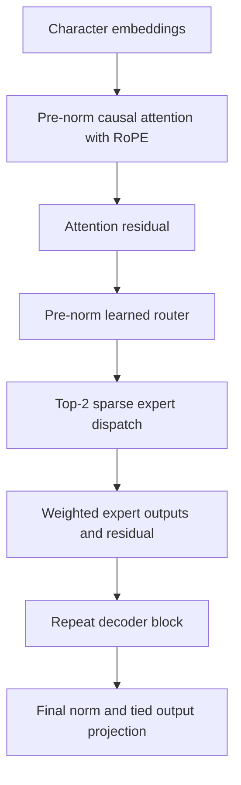
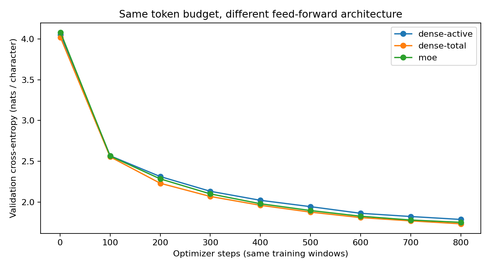
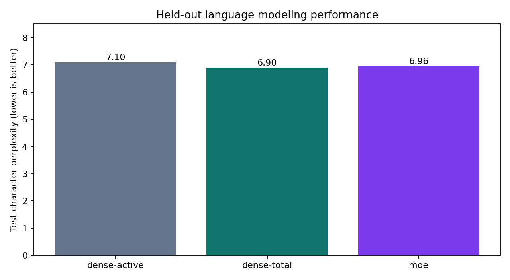
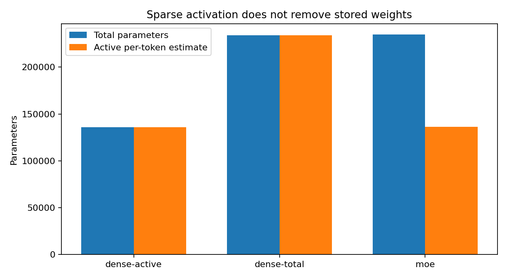
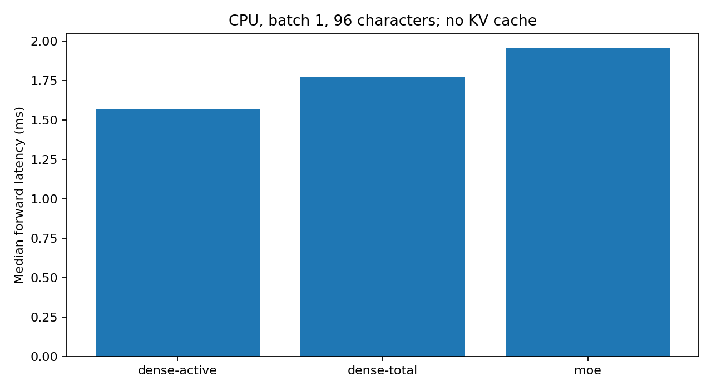
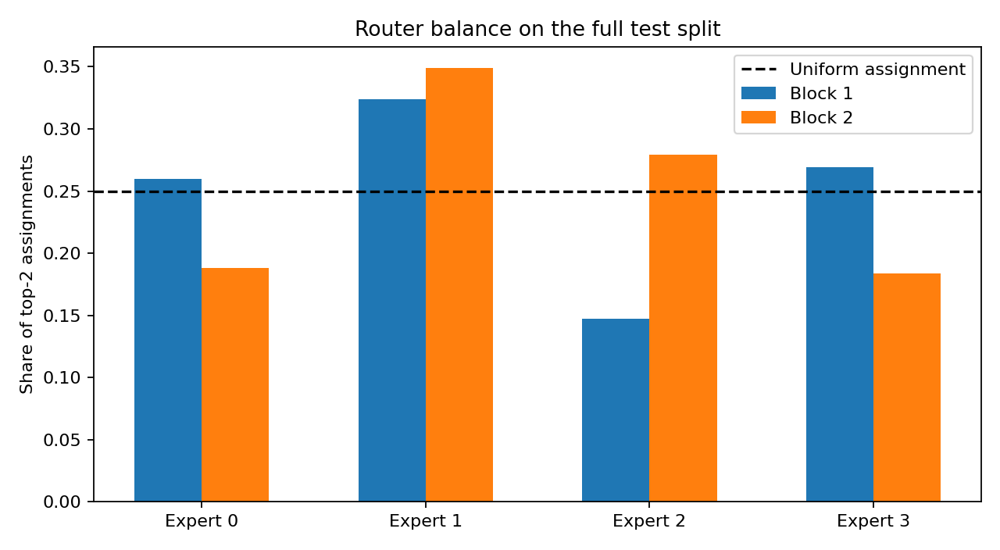
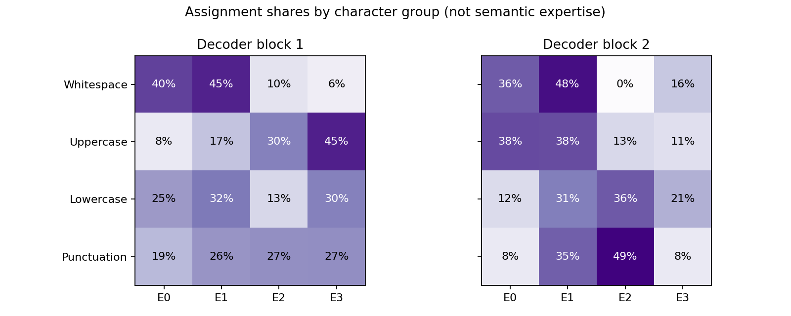

# RouteCraft MoE

A small TensorFlow language model built to make sparse expert routing visible and testable.

## The question

Can a Transformer retain the quality of a larger feed-forward network while using only part of its expert weights for each token?

This project implements the model internals rather than calling an LLM API. There are no pretrained weights: the embeddings, attention projections, router, and expert networks all learn from Tiny Shakespeare. It is a character-level architecture experiment, not a general-purpose chatbot.

## Architecture

Two pre-normalized decoder blocks, four attention heads, a 64-dimensional residual stream, and a 96-character context. Each block uses rotary query/key positions and a causal attention mask. Its feed-forward sublayer contains four SwiGLU experts; a learned router chooses two for each token and normalizes their mixture weights.

Only assigned tokens enter an expert's matrix multiplications. No tokens are dropped, and there is no expert capacity cutoff. The auxiliary balancing loss discourages overloaded routing; it does not enforce uniform assignments. All expert weights remain stored in memory.

Attention, adjacent-pair RoPE, sparse dispatch, mixture aggregation, tied output projection, and the training loop are implemented in this repository. TensorFlow supplies tensor operations, automatic differentiation, dense layers, normalization, and the optimizer. This combines established techniques; it does not introduce a new MoE algorithm.

## Measured results

Training finished on **1 October 2026, Riyadh time**. Each architecture received exactly **1,228,800 sampled character targets**, using the same windows in the same order, seed 42, and 800 optimizer steps. Checkpoints were chosen on 128 fixed validation windows; final validation and test metrics cover 111,456 targets each.

| Model | Total parameters | Active per-token estimate | Validation NLL | Test perplexity | Test next-character accuracy |
| :--- | ---: | ---: | ---: | ---: | ---: |
| Dense, active-matched | 135,872 | 135,872 | 1.8448 | 7.0968 | 43.65% |
| Dense, total-matched | 234,176 | 234,176 | **1.7944** | **6.9003** | **44.07%** |
| RouteCraft MoE | 234,688 | 136,384 | 1.8113 | 6.9610 | 43.52% |

The training-only unigram baseline reached test perplexity **28.4441**. Lower perplexity is better. NLL is cross-entropy in nats per character, without the auxiliary routing loss.

The larger dense model won on validation and test perplexity. The MoE model came close with about 42% fewer parameters involved per token, but that estimate is **not a FLOP count or a speedup**. On this CPU, median forward latency was 1.95 ms for MoE versus 1.77 ms for the total-matched dense model. Sparse dispatch has overhead at this scale.

This is one seed on a small corpus. Equal token budgets do not mean equal wall-clock compute, and these differences are not evidence of a statistically established advantage.

## What the router learned

Both blocks use all four experts on held-out text. Assignment shares range from about 15% to 35%, rather than collapsing into one route. The category heatmap shows different routing patterns for spaces, capitalization, lowercase letters, and punctuation. These are character-group associations, not proof of semantic expert specialization.

`runs/routing_by_character.csv` contains the actual counts. An independent routing pass checks those counts against the recorded evaluation metrics. Every test token receives exactly two expert assignments in each block.

## Diagnostics

| Training progress | Held-out comparison |
| :---: | :---: |
|  |  |

| Stored and active parameters | Observed CPU latency |
| :---: | :---: |
|  |  |

| Expert usage | Routing by character group |
| :---: | :---: |
|  |  |

## Where it still fails

The checkpoints learn recognizable word fragments and dialogue formatting, but generated passages are often ungrammatical and inconsistent. They do not demonstrate factual reasoning or instruction following. The 96-character context limits longer dependencies; the highest-loss held-out windows are included in `runs/error_analysis.json` for inspection. Samples use the same prompt, temperature, and generation seed for every model, without choosing a flattering output.

CPU timings cover a single 96-character forward pass: five warmup calls, then 30 measured calls with materialized output. They exclude tokenizer and sampling work. There is no KV cache, distributed expert execution, or GPU benchmark.

## Data and split

[Tiny Shakespeare](https://github.com/karpathy/char-rnn/blob/6f9487a6fe5b420b7ca9afb0d7c078e37c1d1b4e/data/tinyshakespeare/input.txt), 1,115,394 characters. The contiguous split is 80% training, 10% validation, and 10% test. The 65-character vocabulary is learned from training text only, and no input/target window crosses a split boundary. Repeated phrases can still occur across plays; contiguous splitting is not a deduplication guarantee.

The source commit, full SHA-256, vocabulary, and exact boundaries are in `data/manifest.json`. The unmodified corpus is downloaded from that pinned source rather than redistributed here.

## Repository structure

- `model.py` — attention, RoPE, SwiGLU, sparse experts, and decoder.
- `train.py` — fixed-budget training, checkpoint selection, and evaluation.
- `generate.py` — local checkpoint inference.
- `inspect_run.py` — routing counts, error windows, and figures.
- `verify_run.py` — checkpoint replay and artifact integrity checks.
- `tests/` — causality, gradients, sparse/reference equivalence, and reload tests.
- `runs/` — trained checkpoints, measured results, training windows, and generated samples.
- `figures/` — plots derived from recorded results.
- `USAGE.md` — command-line reference.

## References and provenance

- [Switch Transformers](https://www.jmlr.org/papers/v23/21-0998.html): sparse expert routing and load-balancing motivation. This project uses top-2 routing, not the paper's top-1 Switch design.
- [RoFormer](https://arxiv.org/abs/2104.09864): rotary position embeddings.
- [GLU Variants Improve Transformer](https://arxiv.org/abs/2002.05202): SwiGLU feed-forward networks.

Built for Saud Alotaibi with AI-assisted implementation. Results come from the executed local training run; no paid LLM calls or pretrained model outputs are used.
